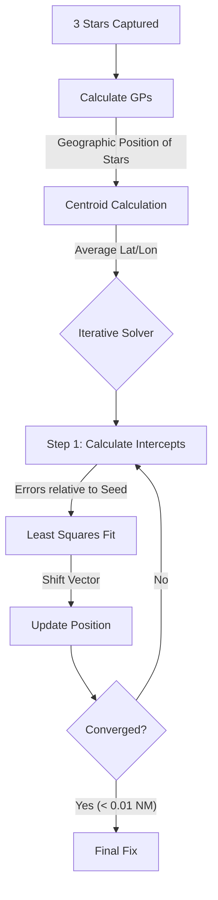

# The Iterative Solver & "Estimated Position"

## The Paradox of "Estimated Position"
You correctly noticed that `lop_compute` asks for an Estimated Position (EP), but the app (Settings Screen) provides no way to input it.

*   **Why it asks**: The classic "Intercept Method" math *requires* a starting guess to draw a Line of Position.
*   **What the app does**: `MainActivity` passes `0.0, 0.0` (Null Island) as the EP for single-image LOPs.
*   **Consequence**: The "Intercept" displayed for a single image is actually the distance from (0,0) to the LOP, which renders the individual LOP display mostly meaningless for navigation.

## The Solution: Automated Iteration (`solve_iterative`)
The app bypasses the need for a user-supplied EP by calculating its own. It uses the stars themselves to find a "Seed" position and then refines it.

### Workflow

### 1. Seeding (The "Guess")
Instead of asking you, the solver looks at the **Geographic Position (GP)** of the 3 stars at the moment of capture.
*   **GP**: The point on Earth directly below the star.
*   **Seed**: It takes the average (centroid) of these 3 GPs.
*   *Logic*: You must be somewhere roughly "among" these stars for them to be visible and high in the sky.

### 2. Iteration (Refinement)
The solver runs a loop (max 5 times):
1.  **Calculate**: Uses the current *Seed* to calculate the Intercepts for all 3 stars.
2.  **Least Squares**: Solves for a "Shift" (Nudge North/East) that minimizes the total error.
3.  **Update**: Moves the Seed by that shift.
4.  **Repeat**: uses the new position as the Seed.

This allows the app to converge on a high-precision fix (often within miles or better) without *any* input from the user, effectively making the "Estimated Position" field obsolete.
